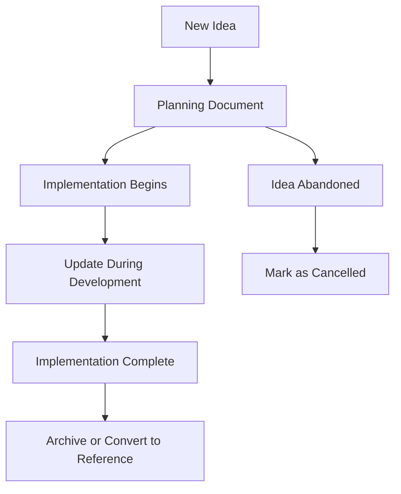

# Notes: Development documentation and planning

The `notes/` directory contains **development documentation**, architectural decision records, and planning documents that capture the reasoning behind design choices and future development directions for the Aimagain project.

## 🎯 Core philosophy: documented decision-making

Notes serve as **institutional memory** for the project, preserving the context and reasoning behind architectural decisions, implementation approaches, and development plans to guide future development and onboarding.

### What we do ✅

- **Architectural decisions**: Document major design choices and their rationale
- **Development planning**: Track feature roadmaps and implementation strategies
- **Process documentation**: Record development workflows and procedures
- **Implementation guides**: Provide detailed guides for complex features
- **Future roadmap**: Plan upcoming features and technical improvements

**Example**: Planning document structure with clear implementation guidance:

```markdown
# Feature planning document

## 🎯 Objective

Clear statement of what we're trying to achieve and why.

## 🏗️ technical approach

- Implementation strategy
- Technology choices and rationale
- Integration points with existing code

## 📋 Implementation plan

1. **Phase 1**: Foundation work
2. **Phase 2**: Core feature implementation
3. **Phase 3**: Polish and optimization

## 🚨 Risks and considerations

- Technical challenges
- Breaking changes
- Migration requirements
```

### What we don't do ❌

- **Implementation code**: Actual code belongs in `/src/`, not documentation
- **User documentation**: User-facing docs belong in main README or dedicated docs site
- **Temporary notes**: Temporary development notes should be cleaned up regularly
- **Outdated planning**: Remove or update plans that are no longer relevant

**Example**: Don't store implementation details that belong in code:

````markdown
<!-- ❌ Wrong - implementation code in notes -->

## Database schema

```sql
CREATE TABLE conversations (
    id UUID PRIMARY KEY,
    ...
);
```
````

<!-- ✅ Correct - architectural reasoning and approach -->

## Database design decisions

We chose UUID primary keys for conversations because:

- Enables distributed systems compatibility
- Prevents enumeration attacks
- Allows offline ID generation

See `/src/models/conversation.py` for implementation.

```

## 🏗️ Architecture: Knowledge repository for development decisions

**Planning → Documentation → Implementation → Retrospective Updates**

Notes bridge the gap between initial planning and final implementation.

## 📋 Documentation responsibility matrix

| Document                              | Purpose                               | Audience                    |
|--------------------------------------|---------------------------------------|-----------------------------|
| **DOCUMENTATION_PLAN.md**            | Documentation strategy and standards | Developers, future maintainers |
| **deployment_reorganization_plan.md** | Infrastructure and deployment strategy| DevOps, developers          |
| **continuous_deployment_plan.md**     | CI/CD implementation roadmap         | DevOps, project leads       |
| **echobot_plan.md**                   | AI integration feature planning      | Developers, product team    |
| **how_to_participate_in_conversations.md** | User flow and feature documentation | Developers, UX team     |

## 📁 Directory structure

```

notes/
├── DOCUMENTATION_PLAN.md # Meta: Documentation strategy for entire project
├── deployment_reorganization_plan.md # Infrastructure: Deployment architecture decisions
├── continuous_deployment_plan.md # DevOps: CI/CD implementation roadmap
├── echobot_plan.md # Feature: AI integration planning
├── how_to_participate_in_conversations.md # UX: User interaction flow documentation
└── TODO.md # Development: Task tracking and priorities

````

## 🔧 Implementation patterns

### Planning document structure

All planning documents follow this structure for consistency:

```markdown
# [Feature/System name]: [brief description]

## 🎯 Objective
Clear, concise statement of the goal and success criteria.

## 🏗️ current state
What exists today and what needs to change.

## 📋 Requirements
- **Functional**: What the system must do
- **Non-functional**: Performance, scalability, security requirements
- **Constraints**: Technical limitations or business constraints

## 🔧 Technical approach
### Architecture decisions
- Technology choices and rationale
- Integration strategies
- Data flow and system interactions

### Implementation strategy
- Phased rollout plan
- Risk mitigation strategies
- Testing approach

## 📊 Success metrics
How we'll measure if the implementation succeeded.

## 🚨 Risks and mitigation
- Technical risks and solutions
- Timeline risks
- Dependencies and blockers

## 📚 References
- Related documentation
- External resources
- Prior art or inspiration
````

### Decision record pattern

For architectural decisions, use this ADR-inspired format:

```markdown
# Adr: [decision title]

## Status

**Accepted** | Proposed | Deprecated | Superseded

## Context

What situation led to this decision? What forces are at play?

## Decision

What decision was made and why?

## Consequences

What are the positive and negative consequences of this decision?

## Implementation notes

- Key implementation details
- Integration points
- Migration requirements

## Alternatives considered

What other options were evaluated and why were they rejected?
```

### Feature planning pattern

For new feature development:

```markdown
# Feature: [feature name]

## 🎯 User story

As a [user type], I want [capability] so that [benefit].

## 🏗️ technical breakdown

### Backend changes

- New models/schemas needed
- API endpoints to create/modify
- Service layer changes

### Frontend changes

- New templates/pages
- Form handling
- User interaction flows

### Integration points

- How feature integrates with existing systems
- Dependencies on other features
- Data migration requirements

## 📋 Implementation phases

### Phase 1: foundation

- Core data models
- Basic API endpoints
- Database migrations

### Phase 2: user interface

- Template creation
- Form handling
- Basic user flows

### Phase 3: enhancement

- Advanced features
- Performance optimization
- Polish and edge cases

## 🧪 Testing strategy

- Unit test coverage
- Integration test scenarios
- User acceptance criteria
```

### Documentation maintenance pattern

Keep notes current and valuable:

```markdown
# Document maintenance guidelines

## Review schedule

- **Planning docs**: Review every sprint/milestone
- **Implementation guides**: Update when implementation changes
- **Decision records**: Mark as superseded when decisions change

## Cleanup criteria

Remove or archive documents when:

- Implementation is complete and stable
- Decisions have been superseded
- Plans are no longer relevant

## Update triggers

Update documentation when:

- Requirements change
- Implementation differs from plan
- New constraints or opportunities emerge
```

## 🚨 Common documentation issues and solutions

### Issue: Notes becoming stale

**Problem**: Planning documents remain unchanged while implementation diverges
**Solution**: Regular review and update process

```markdown
<!-- ✅ Add review dates and status -->

# Feature planning document

**Status**: In Progress | Complete | Outdated
**Last Updated**: 2024-01-15
**Next Review**: 2024-02-15

<!-- Update status as implementation progresses -->

## Implementation status

- [x] Phase 1: Backend models (Completed 2024-01-10)
- [ ] Phase 2: API endpoints (In Progress)
- [ ] Phase 3: Frontend templates (Planned)
```

### Issue: Duplicate or conflicting information

**Problem**: Multiple documents covering the same topic with different information
**Solution**: Clear document ownership and cross-references

```markdown
<!-- ✅ Clear document scope and references -->

# Database design decisions

**Scope**: High-level architectural choices for data storage
**Implementation**: See `/src/models/README.md` for detailed model documentation
**Related**:

- `deployment_plan.md` for database hosting decisions
- `migration_strategy.md` for schema change process
```

### Issue: Implementation details in planning docs

**Problem**: Planning documents become implementation guides instead of decision records
**Solution**: Separate planning from implementation guidance

```markdown
<!-- ❌ Wrong - implementation details in planning -->

## Database setup

1. Install PostgreSQL 14
2. Create database: `createdb aimagain`
3. Run migrations: `alembic upgrade head`

<!-- ✅ Correct - architectural decisions in planning -->

## Database technology choice

We selected PostgreSQL because:

- ACID compliance for data integrity
- JSON support for flexible data
- Strong ecosystem and tooling

**Implementation**: See deployment documentation for setup procedures.
```

## 🔄 Maintenance workflow

### Regular review process

1. **Sprint planning**: Review active planning documents
2. **Implementation**: Update docs when reality diverges from plan
3. **Sprint review**: Mark completed items, update status
4. **Quarterly**: Archive completed plans, update roadmap

### Document lifecycle



### Quality checklist

Before adding new documentation, ensure:

- [ ] **Clear purpose**: Document has specific, well-defined scope
- [ ] **Target audience**: Clear who should read and use this document
- [ ] **Actionable content**: Information leads to concrete decisions or actions
- [ ] **Update plan**: Clear criteria for when and how to update
- [ ] **Integration**: Links to related documentation and implementation

## 📚 Related documentation

- [../README.md](../README.md) - Project overview and getting started
- [../src/README.md](../src/README.md) - Implementation architecture
- [../deployment/README.md](../deployment/README.md) - Deployment procedures
- [DOCUMENTATION_PLAN.md](DOCUMENTATION_PLAN.md) - Meta-documentation strategy
