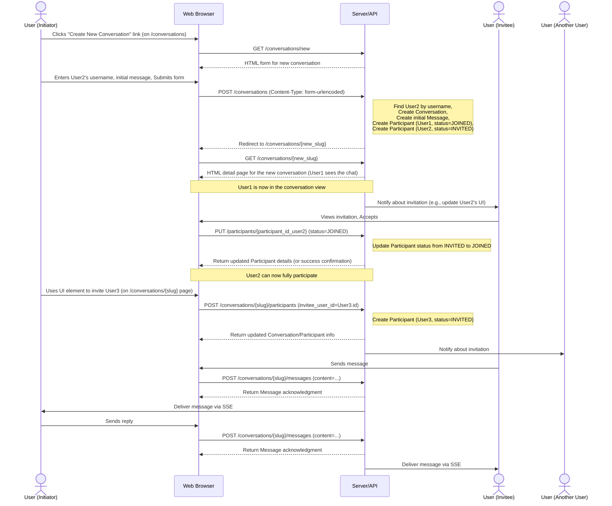

# How to participate in conversations

## Overview

This document describes the typical flow for creating, joining, and participating in conversations in our chat application using the web interface.

## Conversation participation flow

## How it works

1.  **Initiating a Conversation (UI Flow)**:

    - A user clicks "Create New Conversation" (typically on the `/conversations` list page).
    - They are directed to the `/conversations/new` page, which displays a form.
    - The user enters the `username` of the desired _online_ participant and an initial message, then submits the form.
    - The browser sends a `POST` request to `/conversations` with the form data.
    - The backend API finds the invitee user by username, creates the `Conversation`, the initial `Message`, adds the initiator as a `Participant` with `status='joined'`, and adds the invitee as a `Participant` with `status='invited'`.
    - The API responds with a redirect to the new conversation's page (`/conversations/{slug}`).
    - The initiator's browser follows the redirect and loads the conversation detail page.

2.  **Inviting Additional Participants**: Once a conversation exists, any participant who has `JOINED` can invite other _online_ users. This is typically done via UI elements on the conversation page which trigger a `POST` request to `/conversations/{slug}/participants` containing the `invitee_user_id`. These new participants are initially marked with an `INVITED` status.

3.  **Joining a Conversation**: When invited (either initially or subsequently), a user sees the invitation (e.g., in their `/users/me/invitations` list or via a notification). They can accept it, typically by triggering a `PUT` request to `/participants/{participant_id}` with `status='joined'`. This updates their status and grants them full access.

4.  **Messaging**: Only participants with `JOINED` status can send messages (typically via a form `POST` to `/conversations/{slug}/messages`) and receive real-time updates (via SSE) for the conversation.

5.  **Leaving or Rejecting**:
    - An invited user can reject an invitation by updating their participant status to `REJECTED` (e.g., `PUT /participants/{participant_id}` with `status='rejected'`).
    - A joined user can leave by updating their status to `LEFT`.

## Important note

**Only participants with a `JOINED` status can invite _additional_ users to an existing conversation (via `POST /conversations/{slug}/participants`).** The initial creation `POST /conversations` handles the first invitation implicitly based on the submitted username.
