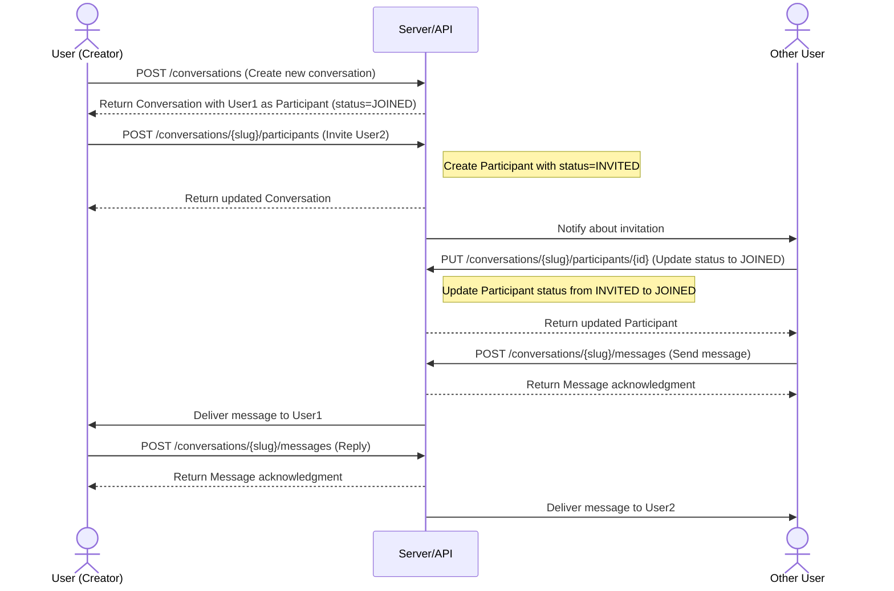

# How to Participate in Conversations

## Overview

This document describes the flow for creating and joining conversations in our chat application.

## Conversation Participation Flow

## How It Works

1. **Creating a Conversation**: A user creates a new conversation by sending a POST request to `/conversations`. The system automatically adds the creator as a participant with a `JOINED` status.

2. **Inviting Participants**: The conversation creator (or any participant with `JOINED` status) can invite other users by sending a POST request to `/conversations/{slug}/participants`. These new participants are initially marked with an `INVITED` status.

3. **Joining a Conversation**: When invited, a user can accept the invitation by updating their participant status from `INVITED` to `JOINED` using a PUT request to `/conversations/{slug}/participants/{id}`.

4. **Messaging**: Only participants with `JOINED` status can send and receive messages in the conversation.

5. **Leaving or Rejecting**: Participants can update their status to `LEFT` to leave a conversation, or `REJECTED` if they decline an invitation.

## Important Note

**Only participants with a `JOINED` status can invite other users to a conversation.** This ensures that conversation membership is controlled by active participants.
